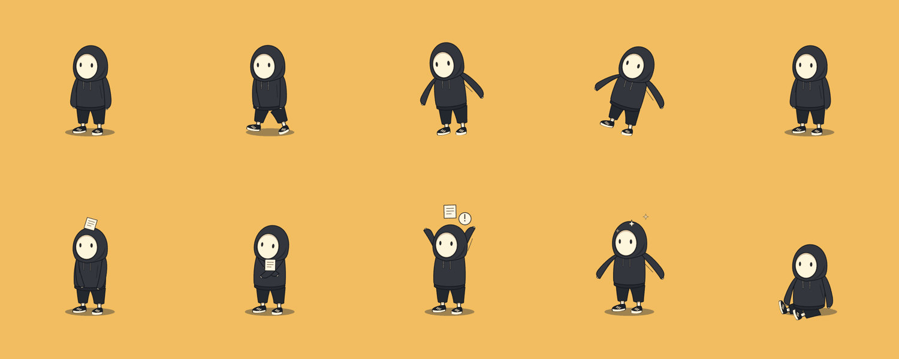
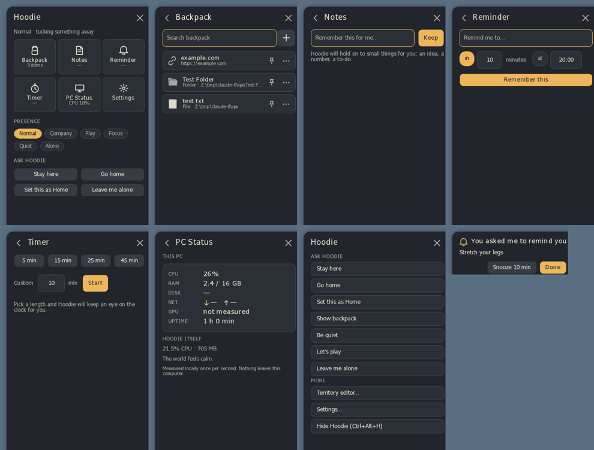
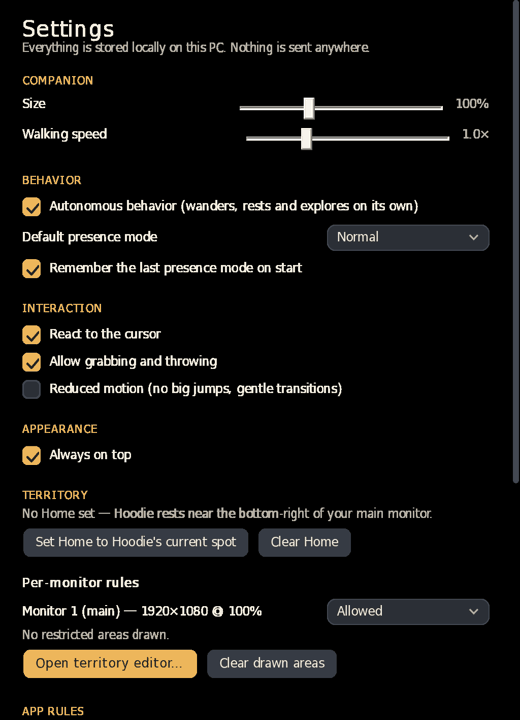
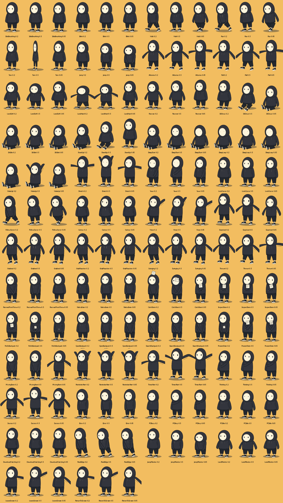

# Hoodie Companion

A small digital creature that lives on your Windows desktop — and doubles as a lightweight interface to useful
PC functions. The character *is* the interface: you give it files, it keeps them in its pocket; you ask it to
remember something, it holds up the note when the time comes; you want space, it politely walks off the screen.



## Launch

1. Download `HoodieCompanion-win-x64.zip`, unzip anywhere (no installer, no admin rights).
2. Run **`HoodieCompanion.exe`**. It is self-contained: no .NET installation needed.
3. Hoodie appears near the bottom-right of your main screen and starts living there.
   A tray icon (bottom-right) is always available. The first launch shows a short hello card.

If Windows SmartScreen warns (the exe is not code-signed): **More info → Run anyway**.

**Supported:** Windows 10 (1809+) and Windows 11, x64. Per-monitor DPI and multiple monitors in any arrangement
(including monitors above/below or at negative coordinates).

## Controls

| Action | What happens |
|---|---|
| **Move the pointer near Hoodie** | It looks at your "hand"; lingers → curious; rush at it → surprised |
| **Left click** | Small wave + the **Quick Panel** opens beside it (click again or press Esc to close) |
| **Right click** | Commands card: Stay here / Go home / Set Home / Show backpack / Be quiet / Let's play / Leave me alone / Territory / Settings / Hide |
| **Drag Hoodie** | Pick it up (the hood is the natural handle). The hood follows your pointer first, the body swings behind it, legs dangle |
| **Swing and release** | Hoodie is thrown with your pointer's velocity, flies (also onto another monitor), lands, dusts itself off and looks at you |
| **Drop files / folders / apps / links on Hoodie** | It notices, catches, inspects and tucks the item into its **Backpack** (hoodie pocket) |
| **Tray icon** | Left click: panel (or show Hoodie if hidden). Right click: full menu incl. **Hide Hoodie** and **Exit** |
| **Ctrl + Alt + H** | Emergency hide / show, instantly |

## Quick Panel



* **Backpack** — everything you gave Hoodie: search, pinned items first; click to open; `⋯` → Rename / Show in folder /
  Remove; `+` → add file / folder / link. Hoodie stores *references* only: it never copies, moves or deletes your files,
  and removing an item only removes Hoodie's reference. If a file has moved, Hoodie searches, shrugs, and offers
  **Locate… / Remove reference / Cancel**.
* **Notes** — "Remember this for me…": small things Hoodie keeps (tick off or delete).
* **Reminder** — "in N minutes" or "at HH:mm". When due, Hoodie holds the note above its head and a small card offers
  **Done** / **Snooze 10 min**.
* **Timer** — 5 / 15 / 25 / 45 min or custom. Hoodie watches the clock and hops when it's done.
* **PC Status** — CPU, RAM, disk activity, network ↓/↑, uptime and Hoodie's own CPU/RAM, sampled locally once per
  second. Under sustained heavy load Hoodie may fan itself (at most once per 10 minutes) — it never nags.
* **Presence** chips and **Ask Hoodie** commands (see below), **Settings**.

## Presence modes (you decide; Hoodie never guesses your mood)

| Mode | Behavior |
|---|---|
| **Normal** | Balanced: wanders, rests, explores other monitors, peeks over edges, naps |
| **Company** | Stays near your pointer, sits nearby, looks at you now and then — no interruptions |
| **Play** | Chases the pointer along the floor, runs, hops |
| **Focus** | "We both do our own work": goes Home / to a Quiet area / to the far corner (another monitor if possible), sits quietly, no games, no surprises |
| **Quiet** | Visible but calm: sits, sleeps, looks through its pocket |
| **Alone** ("Leave me alone") | Waves, walks off the nearest outer screen edge and stays away. **Come back** (panel, tray or commands) brings it back through the same edge |

Commands: **Come here** (tray), **Stay here** (Hoodie keeps within ~220 px of this spot) / **You're free**, **Go home**,
**Set this as Home**, **Be quiet**, **Let's play**, **Leave me alone**, **Come back**, **Show backpack**.

## Territory — "Hoodie has autonomy, but you own the space"

* **Settings → Territory → Per-monitor rules**: each monitor can be *Allowed*, *Quiet*, *Pass through only* or *Never enter*.
* **Territory editor** (Settings or right click): translucent overlays on every monitor. Drag to mark **Allowed**,
  **Quiet**, **Pass through** or **Never enter** areas; **Erase** removes; **Set Home** + click sets Home. Areas override
  the monitor rule; the most restrictive overlapping area wins.
* Hoodie never *intentionally* enters a Never-enter area and never stops in a Pass-through area. If you throw it into
  one, that's your call — afterwards it walks out.
* Fullscreen games, videos and presentations: Hoodie moves to another monitor or hides until you're done.
* **App rules** (Settings): per process — *Quiet*, *Avoid* (stay off that app's monitor) or *Hide*.

## Settings

Companion size and walking speed · autonomous behavior · default presence mode · cursor reactions · grab/throw ·
**Reduced motion** (no big jumps or squash; gentle transitions) · always on top · Home / monitor rules / restricted areas ·
app rules · PC-load reactions · sounds (soft, only for items, reminders and timers) · start with Windows · data location.



## Local data

Everything is stored locally in **`%LocalAppData%\HoodieCompanion\`**:
`settings.json`, `territory.json`, `inventory.json`, `notes.json`, `reminders.json`, `timers.json`, `icons\`, `logs\`.
Writes are atomic with a `.bak` copy and a `schemaVersion`. Nothing is ever sent anywhere: no cloud, no analytics,
no AI backend. `--data <folder>` uses a different data folder.

## Build

Requirements: [.NET 8 SDK](https://dotnet.microsoft.com/download/dotnet/8.0).

```bat
build-release.bat
```

Cleans `bin/obj/publish`, runs the unit tests, publishes a self-contained single-file Release build and zips it:

* `publish\win-x64\HoodieCompanion.exe`
* `publish\HoodieCompanion-win-x64.zip`

From Linux/macOS the same Windows build can be produced with `./build-release.sh` (uses `EnableWindowsTargeting`).
Open `HoodieCompanion.sln` in Visual Studio / Rider for development; `dotnet test` runs the core test suite.

### Quality tools

* `HoodieCompanion.exe --qa <outDir> --data <tempDataDir>` — automated end-to-end scenario on the real exe
  (life, walking, grab/throw, Backpack, all panel pages, reminder, Leave me alone / Come back, Quiet, Settings,
  Territory editor, multi-monitor travel when available). Writes snapshots and `qa-report.txt` (PASS/FAIL),
  then exits. The pointer is simulated; your real mouse is not touched.
* `HoodieCompanion.exe --render-poses poses.png` — renders every animation clip into a contact sheet.
* `python3 tools/render_rig.py out.svg` — renders the rig from `rig.json` without Windows.
* CI: `.github/workflows/hoodie-companion.yml` builds, tests, runs the QA scenario and a single-instance check on
  `windows-latest` and uploads the zip + QA report as artifacts.

## Project documents

`CHARACTER_BIBLE.md` · `ANIMATION_CATALOG.md` · `PLAN.md` · `PROGRESS.md` · `KNOWN_ISSUES.md`


