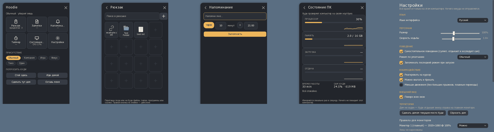
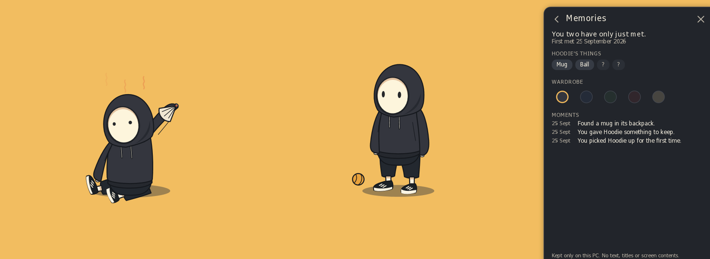
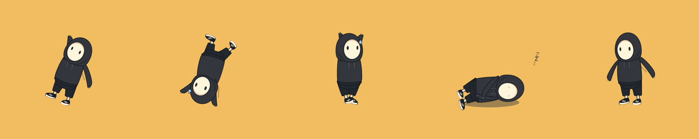
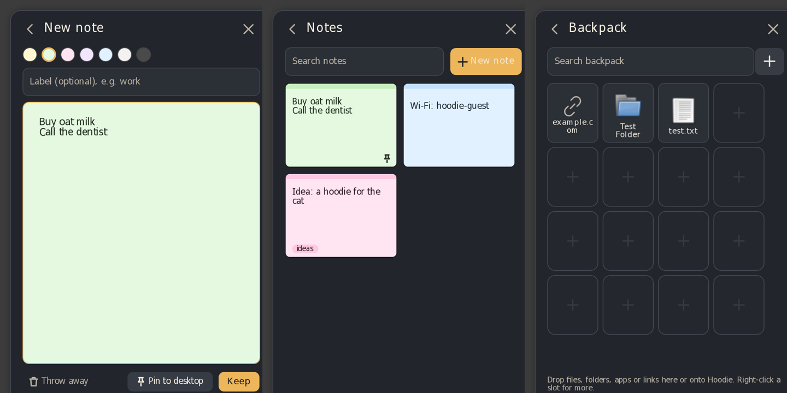

# Hoodie Companion

A small digital creature that lives on your Windows desktop — and doubles as a lightweight interface to useful
PC functions. The character *is* the interface: you give it files, it keeps them in its pocket; you ask it to
remember something, it holds up the note when the time comes; you want space, it politely walks off the screen.


## Launch

1. Download `HoodieCompanion-win-x64.zip`, unzip anywhere (no installer, no admin rights).
2. Run **`HoodieCompanion.exe`**. It is self-contained: no .NET installation needed.
3. Hoodie appears near the bottom-right of your main screen and starts living there.
   A tray icon (bottom-right) is always available. The first launch shows a short hello card.

If Windows SmartScreen warns (the exe is not code-signed): **More info → Run anyway**.

**Languages:** English and Russian (Settings → Language; "Automatic" follows Windows).

**Supported:** Windows 10 (1809+) and Windows 11, x64. Per-monitor DPI and multiple monitors in any arrangement
(including monitors above/below or at negative coordinates).

## Controls

| Action | What happens |
|---|---|
| **Move the pointer near Hoodie** | It looks at your "hand"; lingers → curious; rush at it → surprised |
| **Left click** | Small wave + the **Quick Panel** opens beside it (click again or press Esc to close) |
| **Right click** | Commands card: Stay here / Go home / Set Home / Show backpack / Be quiet / Let's play / Leave me alone / Territory / Settings / Hide |
| **Drag Hoodie** | Pick it up wherever you grab it: by the hood, either hand, a foot (upside down!) or the body — each hangs differently. The held point follows your pointer, the body swings behind it. Held gently for a while it relaxes; swung hard it wriggles and gets dizzy |
| **Swing and release** | Hoodie is thrown with your pointer's velocity, flies (also onto another monitor), lands exactly where its feet touch, dusts itself off and looks at you. Dropped below the taskbar edge, it grabs the edge and climbs back up |
| **Right-click the desktop** | **Hoodie ▸ Come here · Stay here · Set Home here · Open panel · Hide / show** (Windows 11: under "Show more options"). Can be turned off in Settings |
| **Drop files / folders / apps / links on Hoodie or on the open Backpack page** | It notices, catches, inspects and puts the item into its **backpack** |
| **Tray icon** | Left click: panel (or show Hoodie if hidden). Right click: full menu incl. **Hide Hoodie** and **Exit** |
| **Ctrl + Alt + H** | Emergency hide / show, instantly |

## Quick Panel




* **Backpack** — an inventory grid with slots: everything you gave Hoodie (shortcuts, files, folders, apps, links, and
  shell objects such as the **Recycle Bin** or This PC). Pictures show a thumbnail. Drop things onto the page or onto Hoodie;
  click a slot to open it (opens in the background, folders open fast through the running Explorer); **drag slots to arrange
  them**; right-click a slot → Open / Pin to the front / Rename / Show in folder / Move left/right / Remove; `+` → add
  file / folder / **app (search, e.g. "Calculator")** / link. While the page is open Hoodie holds its
  backpack open and rummages in it. Hoodie stores *references* only: it never copies, moves or deletes your files,
  and removing an item only removes Hoodie's reference. If a file has moved, Hoodie searches, shrugs, and offers
  **Locate… / Remove reference / Cancel**.
* **Notes** — a small Sticky Notes board: colourful cards laid out like an inventory, search, 7 colours, optional labels,
  mark as done. A card opens the editor; **Pin to desktop** keeps a note floating on top of everything (move it by its
  top strip, resize from the corner, × unpins). Hoodie writes while you type, stops to think when you pause, finishes
  neatly when you **Keep** a note — and tears the page out, crumples it and tosses it away when you **throw it away**
  or abandon a new note.
* **Reminder** — "in N minutes" or "at HH:mm". When due, Hoodie holds the note above its head and a small card offers
  **Done** / **Snooze 10 min**.
* **Timer** — 5 / 15 / 25 / 45 min or custom. Hoodie watches the clock and hops when it's done.
* **PC Status** — Hoodie sits down with its laptop and types while you look at CPU, memory, disk and network bars with
  60-second graphs, uptime and Hoodie's own CPU/RAM, sampled locally once per second. Under sustained heavy load Hoodie may fan itself (at most once per 10 minutes) — it never nags.
* **Memories** — how long you've been together, Hoodie's things, its wardrobe (colours it has found) and a journal of
  moments ("rode a window while you dragged it", "found a mug in its backpack").
* **Presence** chips and **Ask Hoodie** commands (see below); **Settings** is the gear in the header.

## Presence modes (you decide; Hoodie never guesses your mood)

| Mode | Behavior |
|---|---|
| **Normal** | Balanced: wanders, explores other monitors (ladder up, rope down), jumps or climbs onto window tops and desktop icons, climbs the side of the screen, reads a book, works on its laptop, writes notes, peeks over edges, sits on the edge of the taskbar swinging its legs, lies around, naps (lying down) |
| **Company** | Stays near your pointer, sits nearby, looks at you now and then — no interruptions |
| **Play** | Chases the pointer along the floor, runs, hops, dances |
| **Focus** | "We both do our own work": goes Home / to a Quiet area / to the far corner (another monitor if possible), sits quietly, no games, no surprises |
| **Quiet** | Visible but calm: sits, sleeps, looks through its pocket |
| **Alone** ("Leave me alone") | Waves, walks off the nearest outer screen edge and stays away. **Come back** (panel, tray or commands) brings it back through the same edge |

Commands: **Come here** (tray), **Stay here** (Hoodie keeps within ~220 px of this spot) / **You're free**, **Go home**,
**Set this as Home**, **Be quiet**, **Let's play**, **Leave me alone**, **Come back**, **Show backpack**.

## A living character

Hoodie has a hidden inner state (energy, mood, curiosity, boredom, sleepiness, stress, affection…) that only shapes what
it chooses — never meters, never guilt. Between decisions an idle director keeps it alive with small, varied moments
(looking around, scratching, stretching, sighing; rarely a spin or a little dance). Events get varied reactions: it dodges
a rushing pointer, reaches for a hovering one, hauls a crate while your CPU is busy, catches falling parcels while
something downloads, facepalms at an error, checks its wrist on the hour and shivers late at night.
When you are away it relaxes (5 min), gets bored (15), explores the desktop (30), gets sleepy (60) and finally lies down
to sleep at Home (90). When you come back it wakes up, notices your pointer and greets you.
Details: PLAN.md (behaviour architecture) and ANIMATION_CATALOG.md (132 clips in 19 states).

### v1.3: it lives here now

Hoodie notices what happens on your PC (which app is in front, a new window, that you're typing, how hard the PC is
working, the time of day) and reacts in ways you can connect to it: while you type it quietly moves off your work; a
new window makes it look over (a curious Hoodie walks up to it); when the PC runs hot it takes a little fan out of its
backpack; after a long session, when you pause, it walks over with a mug and suggests a break; the window it stands on
can take it for a ride. It often chooses to do nothing at all. Every Hoodie has its own character (curious, lazy,
bold, cautious…), remembers favourite spots, gets used to things that happen a lot, and over days finds new things:
a mug, a ball, a fan, a blanket, new moves and new hoodie colours. **Memories** in the panel shows the moments you
shared and its wardrobe. Nothing to grind, no dailies, nothing lost by being away.







## Territory — "Hoodie has autonomy, but you own the space"

* **Settings → Territory → Per-monitor rules**: each monitor can be *Allowed*, *Quiet*, *Pass through only* or *Never enter*.
* **Territory editor** (Settings or right click): translucent overlays on every monitor with a legend explaining each area.
  Drag to mark **Allowed** (walk, stop, sit, play), **Quiet** (allowed but calm), **Pass through** (may cross, never
  stops) or **Never enter** areas; **Erase** + click removes an area; **Set Home** + click sets Home. All tools stay
  clickable at any time. Areas override
  the monitor rule; the most restrictive overlapping area wins.
* Hoodie never *intentionally* enters a Never-enter area and never stops in a Pass-through area. If you throw it into
  one, that's your call — afterwards it walks out.
* Fullscreen games, videos and presentations: Hoodie moves to another monitor or hides until you're done.
* **App rules** (Settings): per process — *Quiet*, *Avoid* (stay off that app's monitor) or *Hide*.

## Settings

Simple on the outside: size, walking speed, autonomy, default mode, grab/throw, **Reduced motion**, sounds, start with
Windows, language. Deeper, in collapsed groups: **Territory and apps** (Home, monitor rules, drawn areas, app rules),
**Privacy and data** (what Hoodie notices and why, what it remembers, what it never reads; switches for app learning
and typing detection; *Forget everything Hoodie learned*), **Advanced** (cursor reactions, PC-load reactions, climbing
windows, always on top, desktop menu) and **Performance and debug** (what Hoodie is thinking and why, its traits, its
own CPU / RAM / handles / GDI / USER objects, current and peak).


## Local data

Everything is stored locally in **`%LocalAppData%\HoodieCompanion\`**:
`settings.json`, `territory.json`, `inventory.json`, `notes.json`, `reminders.json`, `timers.json`, `memory.json`, `icons\`, `logs\`.
`memory.json` holds only safe facts (time together, app *names* and minutes, favourite spots, counts, moments, found
things). Hoodie never stores typed text, passwords, window titles, documents or messages, and takes no screenshots.
Writes are atomic with a `.bak` copy and a `schemaVersion`. Nothing is ever sent anywhere: no cloud, no analytics,
no AI backend. `--data <folder>` uses a different data folder.

## Build

Requirements: [.NET 8 SDK](https://dotnet.microsoft.com/download/dotnet/8.0).

```bat
build-release.bat
```

Cleans `bin/obj/publish`, runs the unit tests, publishes a self-contained single-file Release build and zips it:

* `publish\win-x64\HoodieCompanion.exe`
* `publish\HoodieCompanion-win-x64.zip`

From Linux/macOS the same Windows build can be produced with `./build-release.sh` (uses `EnableWindowsTargeting`).
Open `HoodieCompanion.sln` in Visual Studio / Rider for development; `dotnet test` runs the core test suite.

### Quality tools

* `HoodieCompanion.exe --qa <outDir> --data <tempDataDir>` — automated end-to-end scenario on the real exe
  (life, walking, grab/throw, Backpack, all panel pages, reminder, Leave me alone / Come back, Quiet, Settings,
  Territory editor, multi-monitor travel when available). Writes snapshots and `qa-report.txt` (PASS/FAIL),
  then exits. The pointer is simulated; your real mouse is not touched.
* `HoodieCompanion.exe --render-poses poses.png` — renders every animation clip into a contact sheet.
* `python3 tools/render_rig.py out.svg` — renders the rig from `rig.json` without Windows.
* CI: `.github/workflows/hoodie-companion.yml` builds, tests, runs the QA scenario and a single-instance check on
  `windows-latest` and uploads the zip + QA report as artifacts.

## Project documents

`CHARACTER_BIBLE.md` · `ANIMATION_CATALOG.md` · `PLAN.md` · `PROGRESS.md` · `KNOWN_ISSUES.md`


